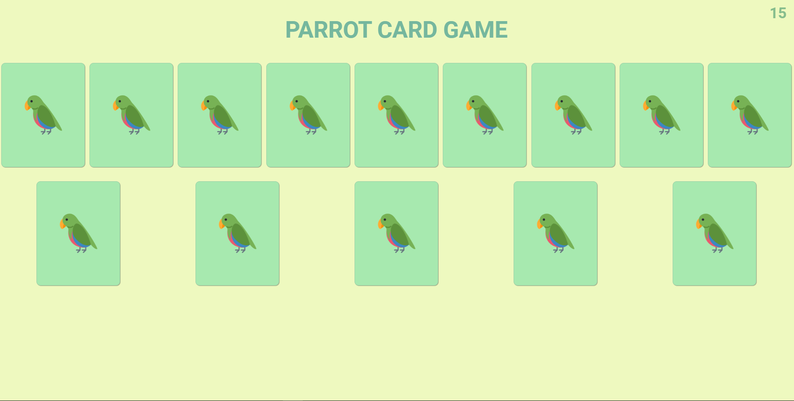
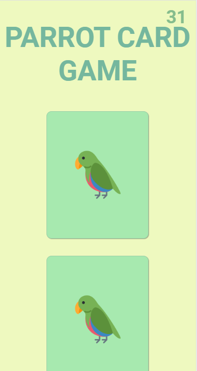

# projeto4-parrots
 
 ### Jogo Parrot Card Game, um jogo da memória temático com aleatoriedade, efeitos e transição, responsividade e papagaios dançantes!

 

## Ferramentas utilizadas 🔨:

 
 
    
    
    

 

### Versão descktop 👇:

### Versão mobile 👇:

